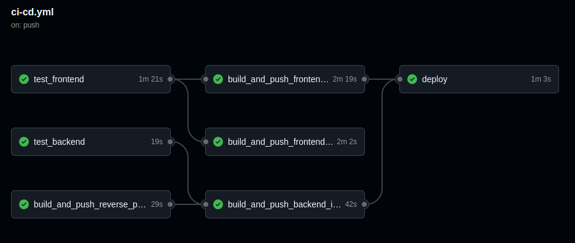

# tq_solution

This project provides a comprehensive solution for setting up and managing a desktop/web application using Docker and Kubernetes on Google Cloud. It includes scripts for building and pushing Docker images, starting the application, and configuring Google Cloud resources.

## Index
- [tq\_solution](#tq_solution)
  - [Index](#index)
  - [Pipeline Status](#pipeline-status)
  - [Project live!](#project-live)
  - [Introction Presentation](#introction-presentation)
  - [Quick Start Desktop/Web Solution on your local machine](#quick-start-desktopweb-solution-on-your-local-machine)
  - [Build All Docker Images](#build-all-docker-images)
  - [Push All Docker Images to Docker Hub](#push-all-docker-images-to-docker-hub)
  - [Setting Up Google Cloud](#setting-up-google-cloud)
    - [Set Variables](#set-variables)
    - [Install and Authenticate Google Cloud SDK](#install-and-authenticate-google-cloud-sdk)
    - [Create GKE Cluster](#create-gke-cluster)
    - [Interact with Created GKE Cluster Using kubectl on Your Host Machine](#interact-with-created-gke-cluster-using-kubectl-on-your-host-machine)
    - [Generate Kubernetes Manifests to Cluster](#generate-kubernetes-manifests-to-cluster)
    - [Verify](#verify)
    - [Upgrade/Rolling Restart of the Nodes in the Cluster](#upgraderolling-restart-of-the-nodes-in-the-cluster)
  - [Setting up CI/CD](#setting-up-cicd)
    - [What is CI/CD?](#what-is-cicd)
    - [The CI/CD Process in tq\_solution](#the-cicd-process-in-tq_solution)
      - [Triggering the Workflow](#triggering-the-workflow)
      - [Testing the Backend](#testing-the-backend)
      - [Testing the Frontend](#testing-the-frontend)
      - [Building and Pushing Docker Images](#building-and-pushing-docker-images)
      - [Deploying to Google Kubernetes Engine (GKE)](#deploying-to-google-kubernetes-engine-gke)
    - [Why is CI/CD Important?](#why-is-cicd-important)

## Pipeline Status
[![CI/CD Pipeline][def]](https://github.com/pprajap/tq_solution/actions/workflows/ci-cd.yml)
<!-- add image -->
[](https://github.com/pprajap/tq_solution/actions/workflows/ci-cd.yml)

## Project live!
http://34.32.71.110:3000/apptq_frontend.html

## Introction Presentation
[Presentation Link](https://docs.google.com/presentation/d/1qwqgRXpfgGatwbIHXP70Sn6GKGLI-yNwz298czE1fZY/edit?usp=sharing)

## Quick Start Desktop/Web Solution on your local machine
```sh
./start_desktop_solution.sh 
```
OR
```sh
./start_web_solution.sh 
```
Note: do you have mac / windows? make sure you read https://github.com/pprajap/tq_frontend/blob/main/README.md to set up necessary environment

## Build All Docker Images
```sh
./build_docker_images.sh
```

## Push All Docker Images to Docker Hub
```sh
./push_docker_images.sh
```

## Setting Up Google Cloud

### Set Variables
```sh
CLUSTER_NAME="your-cluster-name"
ZONE="your-cluster-zone"
```

### Install and Authenticate Google Cloud SDK
```sh
gcloud init
gcloud auth login
gcloud config set project YOUR_PROJECT_ID
```

### Create GKE Cluster
```sh
gcloud container clusters create $CLUSTER_NAME --num-nodes=3 --zone=$ZONE
```

### Interact with Created GKE Cluster Using kubectl on Your Host Machine
```sh
gcloud container clusters get-credentials $CLUSTER_NAME --zone=$ZONE
```

### Generate Kubernetes Manifests to Cluster
1. Download latest Kompose:
  ```sh
  # Download and install Kompose
  curl -L https://github.com/kubernetes/kompose/releases/latest/download/kompose-linux-amd64 -o kompose
  chmod +x kompose
  sudo mv kompose /usr/local/bin/kompose
  ```

2. Convert Docker Compose to Kubernetes Manifests:
  ```sh
  kompose convert -f docker-compose-web.yml
  ```

3. Apply the Manifests:
  ```sh
  kubectl apply -f k8_manifests/.
  ```

### Verify
```sh
kubectl get services
kubectl get deployments
kubectl get pods
kubectl get nodes
```

### Upgrade/Rolling Restart of the Nodes in the Cluster
1. Get the Current Node Version:
  ```sh
  CURRENT_NODE_VERSION=$(gcloud container clusters describe $CLUSTER_NAME --zone $ZONE --format="get(currentNodeVersion)")
  ```

2. Upgrade the Nodes to the Same Version to Restart Them:
  ```sh
  gcloud container clusters upgrade $CLUSTER_NAME --zone $ZONE --cluster-version $CURRENT_NODE_VERSION
  ```

[def]: https://github.com/pprajap/tq_solution/actions/workflows/ci-cd.yml/badge.svg?branch=main

## Setting up CI/CD

Let's break down the CI/CD (Continuous Integration/Continuous Deployment) process for the tq_solution project in a way that's easy to understand, even for those who may not be familiar with computer science.

### What is CI/CD?

**Continuous Integration (CI)** is a practice where developers frequently integrate their code changes into a shared repository. Each integration is automatically verified by running tests to detect errors as early as possible.

**Continuous Deployment (CD)** is a practice where code changes are automatically deployed to a production environment after passing all tests. This ensures that the software is always in a deployable state.

### The CI/CD Process in tq_solution

#### Triggering the Workflow

The CI/CD process starts automatically whenever code is pushed to the "main" branch or when a pull request is made to the "main" branch. It can also be triggered manually from the Actions tab in GitHub.

#### Testing the Backend

1. **Checkout Code**: The first step is to check out the code from the repository.
2. **Set Up Python**: Python is set up with the required version (3.10).
3. **Install Dependencies**: All necessary Python packages are installed.
4. **Run Tests**: The backend tests are run using a tool called pytest. This ensures that the backend code is working correctly.

#### Testing the Frontend

1. **Checkout Code**: The code is checked out from the repository.
2. **Install Dependencies**: All necessary packages, including Qt (a framework for building graphical user interfaces), are installed.
3. **Start Xvfb**: A virtual display server (Xvfb) is started to simulate a display environment for running graphical tests.
4. **Build and Run Tests**: The frontend code is built and the tests are run. This ensures that the frontend code is working correctly.

#### Building and Pushing Docker Images

1. **Backend Image**: After the backend tests pass, a Docker image for the backend is built and pushed to Docker Hub (a repository for Docker images).
2. **Frontend Web Image**: After the frontend tests pass, a Docker image for the frontend web application is built and pushed to Docker Hub.
3. **Frontend Desktop Image**: Similarly, a Docker image for the frontend desktop application is built and pushed to Docker Hub.
4. **Reverse Proxy Image**: A Docker image for the reverse proxy (a server that directs client requests to the appropriate backend services) is built and pushed to Docker Hub.

#### Deploying to Google Kubernetes Engine (GKE)

1. **Authenticate to Google Cloud**: The workflow authenticates to Google Cloud using a service account key.
2. **Set Up GKE Credentials**: The workflow sets up credentials to access the Google Kubernetes Engine cluster.
3. **Verify Cluster Services**: Before deployment, the workflow verifies the current state of the cluster services.
4. **Download and Set Up Kompose**: Kompose is a tool that converts Docker Compose files to Kubernetes manifests.
5. **Convert and Apply Manifests**: The Docker Compose file is converted to Kubernetes manifests and applied to the cluster.
6. **Update Images in Deployments**: The workflow updates the images in the Kubernetes deployments to the latest versions.
7. **Check Rollout Status**: The workflow checks the rollout status of the deployments to ensure they are successfully updated.
8. **Verify Cluster Services**: After deployment, the workflow verifies the state of the cluster services again.

### Why is CI/CD Important?

- **Early Detection of Errors**: By running tests automatically on every code change, errors are detected early, making them easier to fix.
- **Consistent Deployment**: Automated deployment ensures that the software is always in a deployable state, reducing the risk of deployment failures.
- **Faster Development**: Developers can focus on writing code rather than manually testing and deploying it, leading to faster development cycles.
